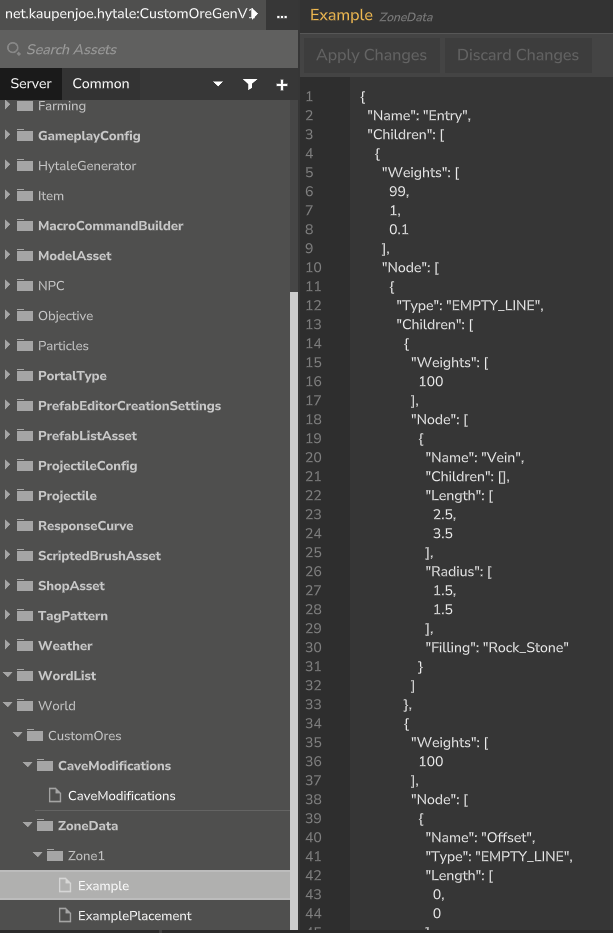
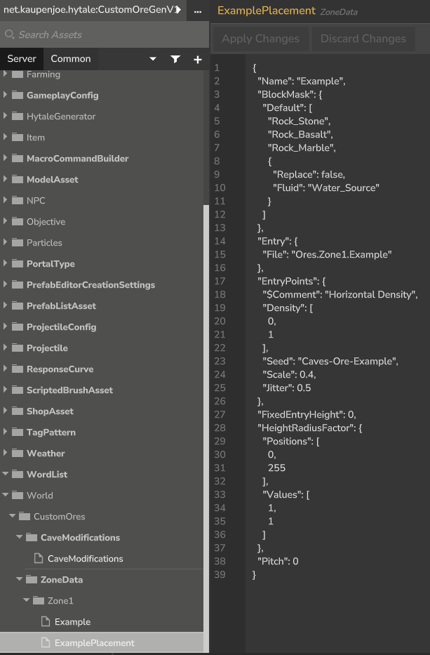
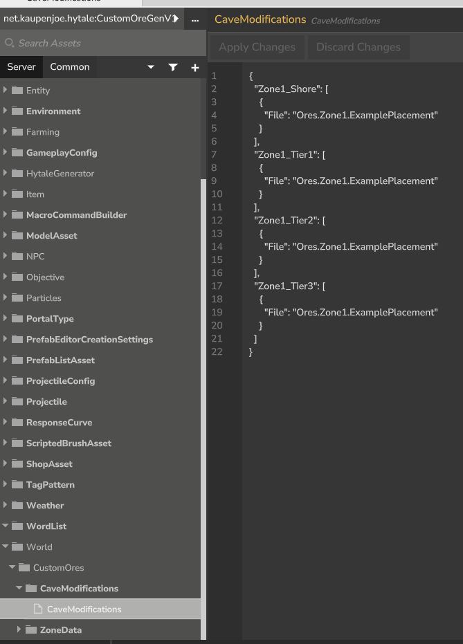

# CustomOreGenV1 - Custom Ore Generation Plugin for Hytale Server

A powerful Hytale Server plugin that enables plugin creators and server owners to fully add custom
ore generation in their worlds using JSON configurations and the built-in Asset Editor.

## 📋 Description

CustomOreGenV1 extends Hytale's default world generation system by allowing you to:

- Define custom ore veins with precise control over size, shape, and distribution
- Configure ore placement by zone and sub zone tiers
- Add cave generation patterns
- Create multiple ore types with weighted spawn chances
- Use the in-game Asset Editor for real-time configuration editing

## ✨ Features

- **Custom Ore Veins**: Define ore vein properties including length, radius, and block types
- **Zone-Based Generation**: Configure different ore distributions for each game zone and tier
- **Weighted Spawning**: Control ore rarity using weight-based probability systems
- **Cave Modifications**: Customize cave generation with ore placements
- **Asset Editor Integration**: Edit configurations in real-time using Hytale's Asset Editor
- **JSON-Based Configuration**: JSON files for all settings
- **No Client-Side Requirements**: Works entirely server-side

## 🎮 How It Works

The plugin replaces Hytale's default world generation provider with a custom one that loads
additional configuration files from the `Server/World/CustomOres/` directory. These configurations
define where and how ores spawn in your world.

### Configuration Structure

```
Server/World/CustomOres/
├── CaveModifications/
│   └── CaveModifications.json    # Links zones to ore placements
└── Ores/
    └── Zone1/
        ├── Example.json           # Defines ore vein properties
        └── ExamplePlacement.json  # Defines placement rules
```

## 📸 Asset Editor Screenshots

### Creating Ore Configurations



*Screenshot showing the Asset Editor interface for configuring custom ore veins*

### Zone Data Management



*Managing zone-specific ore generation settings through the Asset Editor*

### Cave Modifications



*Editing cave modification settings for ore placement*

## 🛠️ Installation

1. Download the latest release of CustomOreGenV1
2. Place the `.jar` file in your Hytale server's `mods/` folder
3. Start your server to generate default configuration files
4. Customize the JSON files in `Server/World/CustomOres/` or use the Asset Editor in-game
5. Use the `/worldgen reload` command to apply changes without restarting the server

## ⚙️ Configuration

### Example Ore Vein Configuration

The plugin uses the base Hytale node structure to define ore veins:

```json
{
    "Name": "Vein",
    "Children": [],
    "Length": [
        2.5,
        3.5
    ],
    "Radius": [
        1.5,
        1.5
    ],
    "Filling": "Example_Block"
}
```

### Zone Placement Configuration

Link your ore definitions to specific zones and tiers:

```json
{
    "Zone1_Tier1": [
        {
            "File": "Ores.Zone1.ExamplePlacement"
        }
    ]
}
```

## 🎨 Using the Asset Editor

1. Join your server with appropriate permissions
2. Open the Asset Editor interface
3. Navigate to **World/CustomOres/**
4. Choose either:
    - **CaveModifications** - Configure zone-to-ore mappings
    - **ZoneData** (Ores) - Define ore vein properties
5. Edit the JSON directly in the editor

Hint: Check the Example files for reference on how to structure your configurations.

Hint2: The CaveModifications.json file is name bound. You must keep the name as is for it to work.

## 👥 Authors

- **Kaupenjoe** - Core development
- **HaRo0** - Refinement
